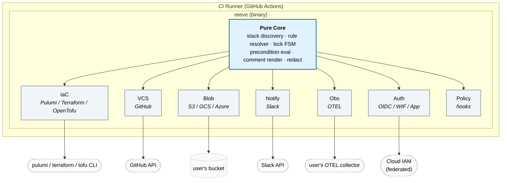

<p align="center">
  
</p>

# reeve

**PR-native, self-hosted GitOps orchestrator for Pulumi, Terraform, and
OpenTofu.** No control plane, no vendor backend, no telemetry, no account -
you own everything.

> Named after the medieval reeve: an official empowered to enforce rules and
> manage an estate on behalf of those who own it. A tool whose entire job is
> to enforce approval policy, manage locks, and act on infrastructure on
> behalf of the team - while owning none of it.

---

## What reeve does

`reeve` is a single Go binary you drop into your CI. On a PR it:

1. Runs the engine's preview (`pulumi preview` / `terraform plan`) for
   every stack touched by the changed files.
2. Posts a single PR comment with per-stack change counts and a collapsible
   plan - edited in place on every push.
3. Gates `/reeve apply` behind approvals, CODEOWNERS, required checks,
   up-to-date base, preview freshness, policy hooks, per-stack FIFO locks,
   and freeze windows — with an opt-in, justification-gated, loudly-audited
   [break-glass](docs/break-glass.md) override for emergencies.
4. Writes locks, run artifacts, and audit entries to **your** bucket (S3 /
   GCS / Azure Blob / R2 / local filesystem).
5. Acquires **short-lived federated credentials** (AWS OIDC, GCP WIF, Azure
   federated, GitHub App) per stack - reeve never stores long-lived secrets.
6. Detects drift on a schedule, classifies events (new / ongoing / resolved),
   and routes to Slack, PagerDuty, webhook, GitHub issues.
7. Emits OpenTelemetry traces and metrics to **your** collector.

Every arrow leaves your trust boundary. `reeve` holds nothing.

## What reeve is not

- **Not a SaaS.** No hosted offering, ever.
- **No telemetry.** No phone-home. The code does not contain the feature.
- **No account.** No login. No registration.
- **MIT.** Not a pivot-later license. Full stop.

---

## Status

Alpha. [v0.2.0](https://github.com/reeveops/reeve/releases/latest) is the
current release: per-platform tarballs (linux/darwin, amd64/arm64) with a
sha256 `checksums.txt` whose cosign keyless signature ships alongside as
`checksums.txt.bundle`. Per-push `<branch>-<sha>` prerelease builds (one per
commit, cosign-signed) back the GitHub Action fast-path (see the pinning
table below).
The release pipeline also publishes a container image
(`ghcr.io/reeveops/reeve`) and is wired to push a Homebrew cask to
`reeveops/brew-tap`. Expect breaking config changes until 1.0 (`reeve
migrate-config` covers renames).

Or build from source:

```bash
git clone https://github.com/reeveops/reeve
cd reeve
mise install         # go, golangci-lint, govulncheck, gosec, hk, goreleaser
go build -o bin/reeve ./cmd/reeve
./bin/reeve --help
```

## Configure

Scaffold `.reeve/` in your repo - `reeve init` discovers your Pulumi stacks
or Terraform root modules, lets you pick the engine (pulumi / terraform /
OpenTofu), and walks you through approvals, freeze windows, and
notifications (use `--non-interactive` for a zero-prompt safe baseline):

```bash
reeve init
```

Or write the two files by hand:

```yaml
# .reeve/shared.yaml
version: 1
config_type: shared
bucket:
  type: s3
  name: mycompany-reeve
  region: us-east-1
approvals:
  default:
    required_approvals: 1
    approvers: ["@org/infra-reviewers"]
preconditions:
  require_up_to_date: true
  preview_freshness: 2h
```

```yaml
# .reeve/pulumi.yaml
version: 1
config_type: engine
engine:
  type: pulumi               # or terraform / tofu
  stacks:
    - pattern: "projects/*"
      stacks: [dev, staging, prod]
```

Add one workflow file and one `uses:` step - the action handles everything else:

```yaml
jobs:
  reeve:
    runs-on: ubuntu-latest
    steps:
      - uses: actions/checkout@v4
      - uses: reeveops/reeve@master
        with:
          pulumi-version: latest
          # slack-token: ${{ secrets.SLACK_BOT_TOKEN }}   # optional
```

### Pinning and binaries

How you pin the action decides where its binary comes from. A per-runner
cache (keyed on the action's source hash) sits in front of every path, so
all of this only matters on a cache miss:

| Pin                | Binary source                                                                                           |
| ------------------ | ------------------------------------------------------------------------------------------------------- |
| `@vX.Y.Z`          | Release tarball from that release, verified against its cosign-signed `checksums.txt`                   |
| `@master` / `@next`| Newest per-push `<branch>-<sha>` prerelease binary, verified against its checksum and cosign signature (best-effort; set `REEVE_REQUIRE_SIGNATURE=1` to require it) |
| anything else      | Built from source on the runner (SHA pins, feature branches, forks)                                     |

Prebuilt paths save the ~30s+ Go toolchain setup + build on first runs. Any
download or checksum failure falls back to the source build automatically -
the run never breaks because a binary wasn't available.

### PR commands

| Event / Comment              | What it does                                                    |
| ---------------------------- | --------------------------------------------------------------- |
| PR opened / reopened / push  | `reeve run preview` runs automatically, posts plan comment      |
| PR converted from draft to ready | `reeve run ready` runs, notifying for approval if a plan has succeeded |
| `/reeve preview` or `/reeve plan` | Re-runs plan for this PR                               |
| `/reeve ready`               | Marks PR ready for approval, posts comment, notifies Slack      |
| `/reeve apply` or `/reeve up` | Applies all planned stacks (subject to approval gates)         |
| `/reeve apply --refresh`     | Reconciles state with live infrastructure, then applies. Turns plan locking off for that run |
| `/reeve refresh [--dry-run] [--all]` | Reconciles state with live infrastructure. Changes no infrastructure — a "delete" means the resource was already gone and was dropped from state |
| `/reeve breakglass "<justification>" apply` | Emergency apply: overrides approvals (and freeze unless disabled), never locks/checks; loudly audited. Requires `break_glass:` config |
| `/reeve unlock [project/stack]` | Frees this PR's stack locks (all, or just one)               |
| `/reeve help`                | Posts a comment listing available commands                      |

Accepted comment prefixes are set by the `command-prefix` input (default
`"/reeve"`). Mention style is no longer accepted by default —
[github.com/reeve](https://github.com/reeve) belongs to a real person, and
`@reeve apply` notified them every time. Add it back if you want it, but
prefer a handle your org controls. Other
`pull_request` actions (labels, assignees, edits) and all bot-authored
comments are ignored, so reeve's own comments never re-trigger a run.
Review approvals don't trigger runs unless you opt in with
`run-on-approval: "true"` (the apply gate re-checks approvals anyway; opting
in only buys the automatic approved-state notification).

> Draft PRs cannot be applied. Convert to ready for review first.

Walk-through from here: [docs/getting-started.md](docs/getting-started.md).

## Local development

reeve uses [mise](https://mise.jdx.dev/) to pin Go and tooling versions:

```bash
mise install           # installs go, goreleaser, golangci-lint, openspec, hk
mise run check         # fmt + vet + lint + test
mise run demo          # runs reeve against examples/toy-stack
mise run build         # bin/reeve
```

Available tasks:

```bash
mise tasks             # list all tasks
mise run test          # go test -race ./...
mise run lint          # golangci-lint (enforces internal/core/* purity)
mise run release-check # goreleaser config validation
```

## Documentation

- [Getting started](docs/getting-started.md) - zero-to-PR-comment in 10 minutes
- [Configuration reference](docs/configuration.md) - every config_type
- [Break-glass apply](docs/break-glass.md) - emergency override: config, command, audit
- [Auth providers](docs/auth.md) - OIDC/WIF/federated/secret managers
- [Drift detection](docs/drift.md) - schedules, channels, bootstrap modes
- [Policy hooks](docs/policy-hooks.md) - OPA, Conftest, CrossGuard, custom
- [Self-hosting](docs/self-hosting.md) - bucket choice, GH App, scope
- [Spec](openspec/specs/) - authoritative per-capability behavior

## Architecture at a glance



Every arrow leaves the `reeve` binary's trust boundary - the user owns
everything it talks to.

## Contributing

`reeve` uses [OpenSpec](https://openspec.dev/) for non-trivial changes. See
[CONTRIBUTING.md](CONTRIBUTING.md) for the workflow.

## License

[MIT](LICENSE). Will stay MIT. If a fork happens later, the original repo
stays MIT under its existing maintainers.
