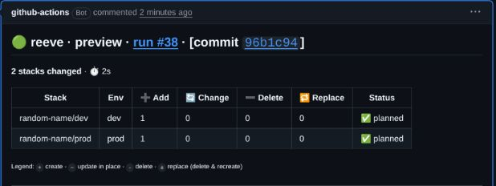

# Getting started

Connect an existing infrastructure repository to Reeve, then preview, review, and apply one small change.
For a local trial without cloud resources, start with the [local demos](../examples/README.md#local-demos).

## Before you begin

You need:

- A GitHub repository with Actions enabled and a working Pulumi, Terraform, or OpenTofu project.
- The engine's state backend and any workload credentials that project already needs.
- A persistent bucket for Reeve's locks, plans, run history, and audit entries.
- A reviewer other than the PR author, with an approver policy appropriate to your repository.

The Reeve bucket and the engine's state backend serve different purposes.
A filesystem Reeve bucket works for a local trial or a test contained in one job; separate Actions runs need shared persistent storage.

## 1. Install the CLI

Install a binary from [Releases](https://github.com/reeveops/reeve/releases), checking the archive against the signed `checksums.txt`, or build the current documented candidate:

```bash
git clone https://github.com/reeveops/reeve
cd reeve
git checkout d31c814640689c2f2e1b0d02d2bc11a80a94faab
mise trust
mise run build
export PATH="$PWD/bin:$PATH"
```

The build requires [mise](https://mise.jdx.dev/) and the Go toolchain specified by this repository.
An older stable CLI may predate the shared-workflow scaffolding below; [versions and binaries](github-actions.md#versions-and-binaries) explains how to keep CLI and workflow behavior aligned.

## 2. Scaffold your infrastructure root

Return to the repository containing your infrastructure and run:

```bash
reeve init --workflow-ref d31c814640689c2f2e1b0d02d2bc11a80a94faab
```

Choose your engine and approval policy in the wizard.
One `.reeve/` directory configures one engine; repositories with multiple engines can use [separate roots](github-actions.md#multiple-roots).

For a non-interactive baseline, add `--non-interactive`.
It enables approval and check defaults, leaves optional integrations unconfigured, and detects HCL as Terraform; OpenTofu users must change `engine.type` to `tofu` and select `opentofu_version` in the caller.

Existing configuration is preserved unless you use `--force`, which creates backups; an existing workflow is always preserved.
Inspect the generated files before committing them.

A **project** is an infrastructure directory and a **stack** is a Pulumi stack or Terraform/OpenTofu workspace.
For project `api` and stack `prod`, the reference is `api/prod`; `*/prod` matches production stacks across projects.

## 3. Connect storage and credentials

Replace the scaffold's filesystem bucket with your persistent bucket.
For example, in `.reeve/shared.yaml`:

```yaml
bucket:
  type: gcs
  name: YOUR_REEVE_BUCKET
```

Follow [self-hosting](self-hosting.md#bucket-provisioning) for S3, GCS, Azure Blob, or R2 provisioning and [authentication](auth.md#which-credentials-go-where) for the corresponding credential wiring.
Keep the engine's existing state backend; Reeve artifacts do not replace Terraform state or Pulumi state.

For GCS, the shared workflow accepts `gcp_workload_identity_provider` and `gcp_service_account` to authenticate the runner to Reeve's bucket.
Workload bindings in `.reeve/auth.yaml` and Pulumi's `engine.state.auth_provider` configure engine credentials separately.

For AWS, Azure, or R2 bucket access, use the supported runner or composite-action setup described in [GitHub Actions](github-actions.md#bucket-authentication).
Adding an AWS workload provider to `auth.yaml` alone does not authenticate the controller's S3 client.

## 4. Check configuration and the workflow

Run these from the infrastructure root:

```bash
reeve lint
reeve stacks
reeve rules explain api/prod
```

Replace `api/prod` with a reference printed by `reeve stacks`.
Check that your production patterns match the intended stacks and that the approver list names real users or teams.

The generated `.github/workflows/reeve.yml` calls the maintained shared workflow.
Compare it with the [canonical caller](github-actions.md#gitops-caller), select one engine version, and add the bucket authentication inputs and permissions your setup requires.

Keep job ID `reeve` when using the standard `reeve / Reeve` required check.
If you add federation after scaffolding, add `id-token: write` yourself; `init` does not overwrite an existing workflow.

An optional local preview uses real engine and backend access:

```bash
reeve plan-run --sha "$(git rev-parse HEAD)" --run-number 1
```

This renders the PR comment locally and skips GitHub interactions; it can contact cloud services and write artifacts.
Use [local auth bindings](auth.md#local-development) when CI providers require GitHub OIDC.

## 5. Open a small infrastructure PR

Commit the configuration and workflow through your normal review process, then change one infrastructure value in a new PR.
The comment-command workflow must be present on the default branch for GitHub to deliver `issue_comment` events.

Expect a successful Actions preview and a Reeve comment listing the affected stacks and changes.
A documentation-only change can correctly select no stacks; use a workload change to exercise the first plan.



[About this screenshot](images/README.md).
If no comment appears, use [the troubleshooting table](operations.md#troubleshooting).

## 6. Review and apply

Have a different, authorized reviewer approve the current commit, then comment:

```text
/reeve apply
```

Draft PRs must become ready for review first.
On public repositories, configure an approver list or CODEOWNERS rather than relying on a bare approval count.

Reeve evaluates approval, preview, and other configured gates before applying; the comment explains a block.
A blocked apply may exit successfully without changing infrastructure, so read the stack results rather than treating a green Actions job as proof of deployment.

Saved plans are used by default when available, but a missing or unreadable plan artifact can cause a fresh plan at apply time.
Read [saved plans and freshness](pull-requests.md#saved-plans-and-freshness) before relying on exact-plan behavior.

## Next steps

- [PR workflow](pull-requests.md): commands, approvals, merge-triggered apply, and plan behavior.
- [Maintenance](operations.md#scheduled-maintenance): schedule lock reaping and artifact retention.
- [Notifications](notifications.md), [drift](drift.md), and [policies](policy-hooks.md): add optional capabilities.
- [Examples and test scenarios](../examples/README.md): explore configurations and the evolving E2E harness.
