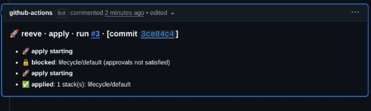

# PR workflow

Reeve previews changes on a PR, explains the gates, and applies when an authorized request satisfies the configured policy.
Set up the workflow with [getting started](getting-started.md); this guide covers daily use.

## Preview, review, apply

1. Open or update a PR with an infrastructure change.
2. Read the stack table and expand the changes you need to inspect.
3. Have an authorized reviewer approve the current commit.
4. Comment `/reeve apply`, then read each stack's result.

Draft PRs cannot apply; converting a draft to ready invokes readiness notification when a successful plan exists.
`/reeve ready` requests the notification without changing the GitHub PR's draft status or granting an approval.



This [recorded test run](images/README.md) used real GitHub review identities and disposable local OpenTofu state.
It illustrates gate outcomes; the trusted harness invoked apply directly.

## Read the result

| Result | Meaning | Next step |
| --- | --- | --- |
| Planned changes | Preview found work for this stack. | Review the diff and approval requirements. |
| No changes | The engine found no resource changes. | No apply is needed for that stack. |
| Blocked | A gate did not pass; apply did not run for that stack. | Read the gate trace or use `/reeve explain`. |
| Failed | A command or dependency errored. | Read the error and Actions log; partial applies may need inspection. |
| Already applied | A clean apply was recorded for this commit. | No action; use `--force` only when intentionally repeating it. |

A blocked apply can exit zero, while an operational error exits nonzero.
A green Actions job alone does not prove infrastructure was deployed.

## PR commands

| Comment | Effect |
| --- | --- |
| `/reeve preview` or `/reeve plan` | Run another preview for this PR. |
| `/reeve ready` | Notify that a successfully planned PR is ready for approval. |
| `/reeve apply` or `/reeve up` | Apply the selected preview's stacks, subject to gates. |
| `/reeve apply --force` | Repeat work despite the already-applied guard; other gates still apply. |
| `/reeve apply --refresh` | Refresh state before applying; disables saved-plan locking for this run. |
| `/reeve refresh --dry-run` | Preview state reconciliation without writing state. |
| `/reeve refresh [--all]` | Reconcile state with live resources; `--all` selects all declared stacks. |
| `/reeve explain [project/stack]` | Report approval rules, locks, and current gates without invoking an engine. |
| `/reeve approve <sha>` | Add a commit-bound approval when comment approvals are enabled. |
| `/reeve unlock [project/stack] [--force]` | Remove this PR's lock/queue entries; force is needed for its active holder. |
| `/reeve help` | Show available commands. |
| `/reeve breakglass "reason" apply` | Request a configured [emergency override](break-glass.md). |

Refresh changes engine state, not infrastructure: a reported deletion means a resource already gone from the cloud is removed from state.
Inspect the dry run first when the result is unfamiliar.

The default prefix is `/reeve`; bot-authored comments are ignored.
Commands are accepted from configured associations (by default owner, member, collaborator), and the apply gates still evaluate afterward.

## Apply on a comment or merge

`apply.trigger: comment` is the default: apply before merging, using a PR comment.
`apply.trigger: merge` applies after a merged `pull_request: closed` event; ordinary apply comments become no-ops.

For merge mode, set both:

```yaml
# .reeve/shared.yaml
apply:
  trigger: merge
preconditions:
  require_up_to_date: false
  require_checks_passing: true
```

```yaml
# In the caller workflow's on: block
pull_request:
  types: [opened, reopened, synchronize, ready_for_review, closed]
```

After merge the base has advanced, so `require_up_to_date: true` can block the original PR head.
Every other configured gate still applies; break-glass is an explicit exception to trigger selection.

## Approval policies

Start with one real reviewer or team in `.reeve/shared.yaml`:

```yaml
approvals:
  default:
    required_approvals: 1
    approvers: ["@your-org/infra-reviewers"]
    dismiss_on_new_commit: true
  stacks:
    "*/prod":
      required_approvals: 2
```

References use `project/stack`: `api/prod` is matched by `*/prod`.
Use `reeve stacks` and `reeve rules explain api/prod` to check the policy before relying on it.

## Approval rule merging

- `approvals.default` is the baseline.
- `approvals.stacks.<pattern>` entries merge with the default for matching
  stacks.
- Scalar fields (`required_approvals`, `require_all_groups`, `codeowners`,
  `dismiss_on_new_commit`, `freshness`) on a pattern **override** the
  default.
- `approvers` lists **union** (deduplicated).
- Patterns with more literal characters win specificity ties, and the
  more-specific pattern's scalar fields override the broader one's.
- `require_all_groups: true` changes semantics: every listed approver
  group must contribute one approval, regardless of `required_approvals`.

**Secure defaults.** reeve fails closed on approvals:

- A stack with **no matching approval policy** still requires **one**
  non-author approval — it does not auto-pass.
- `required_approvals: N` with **no `approvers` list** counts any `N`
  distinct non-author approvals (GitHub's "require N approvals" behavior),
  rather than being unsatisfiable — **on private repos**. On a **public**
  repo this path is blocked (see below), because anyone can review.
- **Public repositories.** On a public repo any GitHub user can submit an
  approving review, so a bare `required_approvals` with no `approvers` list
  and no CODEOWNERS is not a real gate. reeve fails such a stack closed with
  a message telling you to add an `approvers` list or CODEOWNERS — or to set
  `approvals.allow_unlisted_approvals_on_public: true` if you intend
  to count unlisted reviews. The default (`false`) does not remove the
  ability, only forces you to name the risk. Private repos are unaffected,
  and a public repo that already uses an `approvers` list or CODEOWNERS never
  hits this.
- `dismiss_on_new_commit` defaults to **`true`**: pushing a new commit
  invalidates prior approvals. Set it to `false` explicitly to opt out.
- Only a reviewer's **most recent** review counts. A reviewer who approves
  and later requests changes (or whose approval is dismissed) no longer
  counts toward the gate.
- `freshness: <duration>` (opt-in, e.g. `24h`): an approval older than the
  window at evaluation time does not count and must be re-given. Stale
  approvals are called out in the rule trace and the missing list, so a
  blocked apply says exactly whose approval expired. `0`/unset means no
  freshness constraint. An approval without a submission timestamp fails
  closed when freshness is set.

## Approval sources

`approvals.sources` selects which signals count as approvals. Sources are
gathered independently and **unioned** — a human who approves via *both* a
review and a comment counts **once**.

| Source | Default | Signal |
| --- | --- | --- |
| `pr_review` | **on** | A GitHub PR review whose current state is `APPROVED`. |
| `pr_comment` | off (opt-in) | An authorized non-author posting `/reeve approve` in a PR comment. |

- **Omitting the `sources` block** leaves `pr_review` as the only active
  source — identical to reeve's original behavior. No existing config changes.
- `pr_review` stays on unless you list it explicitly with `enabled: false`.
- `pr_comment` is off unless you list it with `enabled: true`.
- **`enabled` is required on every listed source.** If you list a source you
  must set `enabled: true` or `enabled: false` — an omitted `enabled` is a
  load/lint error.

```yaml
approvals:
  sources:
    - type: pr_review
      enabled: true
    - type: pr_comment
      enabled: true
      command: "/reeve approve"   # trigger phrase; default "/reeve approve"
```

**`pr_comment` authorization (fail-closed).** A `/reeve approve` comment counts
only when every condition holds:

- Its first line is `<prefix> approve`, where `<prefix>` exactly matches a
  configured command prefix (the action's `command-prefix`, default `/reeve`)
  — parsed the same way as every other `/reeve` command.
- The commenter's `author_association` is in the same allowlist that gates
  command dispatch (the action's `allowed-associations`, default `OWNER`,
  `MEMBER`, `COLLABORATOR`). reeve **re-checks this at apply time** because it
  reads historical comments directly, not the dispatched event, so an
  unauthorized commenter's `/reeve approve` never counts.
- The commenter is not a bot and is **not the PR author** (the same non-author
  rule reviews follow — an author never self-approves).

**Commit binding under `dismiss_on_new_commit` (default on).** A PR review
carries an authoritative commit id from GitHub, but a comment does not — and the
SHA that was HEAD when a comment was posted *cannot* be reconstructed after the
fact, because git committer timestamps are settable by whoever pushes (a commit
can be backdated to appear older than an approval). So a comment approval is
bound to a commit **only when the commenter names it**:

- `/reeve approve <sha>` — pins the approval to `<sha>` (a 7+ character prefix of
  the commit). If `<sha>` is the current HEAD the approval counts; once a new
  commit lands it no longer matches HEAD and is dismissed, exactly like a stale
  review. Re-approve the new HEAD to satisfy the gate again.
- Bare `/reeve approve` (no SHA) — is **unpinned**. When `dismiss_on_new_commit`
  is on (the default) an unpinned comment approval is **dismissed** (the rule
  trace explains why and suggests re-approving with the SHA). When
  `dismiss_on_new_commit` is `false`, a bare `/reeve approve` counts.

reeve posts the current HEAD short-SHA in its PR comments, so approvers can copy
`/reeve approve <sha>` directly.

**Opting out — `allow_unpinned_comment_approvals`.** If your team trusts its
allowed approvers and prefers the convenience of a bare `/reeve approve`, set
`allow_unpinned_comment_approvals: true`. Unpinned comment approvals then count
even under `dismiss_on_new_commit` (approve-and-stick: the approval survives new
commits). It defaults to `false` (the secure behavior above), rides on any
approval rule so it can be scoped per pattern (e.g. loosen it on `*/dev` while
leaving `*/prod` strict), and has no effect on `pr_review` approvals — those are
always pinned to GitHub's authoritative commit id, and a pinned-but-stale
approval is still dismissed.

```yaml
approvals:
  default:
    allow_unpinned_comment_approvals: false   # secure default
  stacks:
    "*/dev":
      allow_unpinned_comment_approvals: true  # bare /reeve approve is fine on dev
```

> Posting `/reeve approve` also refreshes the approved-state notification
> (Slack "ready to apply"), mirroring the `pull_request_review` path. The
> comment itself is the approval — the apply gate re-reads it (and re-checks
> authorization) at apply time; the comment never triggers an apply.

## CODEOWNERS resolution

When `codeowners: true`, reeve parses the repo's `CODEOWNERS` file and
requires at least one approval from an owner of each changed file.

The **last matching rule wins** for each changed path, matching GitHub's rule ordering.
Earlier rules do not contribute owners; a final matching rule with no owners leaves the path unowned.

```text
* @org/platform
Pulumi.*.yaml @org/engineering
```

For a matching Pulumi stack file, only `@org/engineering` owns that path.
This is separate from Reeve's approval-rule merging, where `approvers` lists union.

Team slugs in CODEOWNERS are expanded the same way as `approvers` entries:
reeve resolves `org/team` → member logins via the VCS API before evaluation.

**Email owners are unenforceable.** GitHub allows email addresses as
CODEOWNERS entries (e.g. `docs@example.com`), but reeve has no
commit-email → login resolution, so email owners are excluded from the
gate: a path owned by both an email and a login/team still requires the
login/team's approval, and a path owned *only* by emails adds no
requirement (the evaluation trace notes the skipped entries instead of
wedging the gate forever). `reeve lint` warns about email owners in
CODEOWNERS.

Inspect the merged result:

```bash
reeve rules explain payments/prod
```

## Other apply gates

[Preconditions](configuration.md#preconditions) control branch freshness, checks, and preview age.
[Freeze windows](configuration.md#sharedyaml), per-stack locks, policy hooks, and fork/draft restrictions also participate.

Break-glass overrides only its [documented gates](break-glass.md#what-is-and-is-not-bypassed).
It does not make a failed check, held lock, or blocking policy pass.

## Saved plans and freshness

Preview history determines which stacks apply; saved-plan artifacts determine what the engine executes when those artifacts are available.
Read both the default and the fallback behavior below.

## Preview freshness

`preconditions.preview_freshness` bounds how old a plan may be at apply time.
It exists for two failure modes, and both are about the world moving while a
plan sits waiting for a human.

**Stale plans on busy repos.** A plan records what *your* PR intended against
the state it saw. It does not record that the state still looks that way. On a
repo where several PRs land in a day, another PR can merge and change a
resource your plan touches — and what happens next depends on
[plan locking](#plan-locking):

- **Plan locking on** (the default): apply executes the plan artifact the
  preview stored. If state moved since that plan was made, the engine
  *refuses* it — Terraform says "saved plan is stale", Pulumi says the update
  exceeds its plan. Safe, but the failure arrives late: after the run started,
  after the stack lock was taken, and on a queue where the next PR is waiting
  behind it. Freshness turns that into an upfront block.
- **Plan locking off**: apply computes a new change set at apply time. Nothing
  errors. The apply simply executes something other than what the reviewer
  read, and the wider the gap between preview and apply, the more it can
  differ.

When the saved artifact is available, plan locking constrains apply to that artifact; the fallback below is an exception.
Freshness limits the age of the preview, but it does not prove that infrastructure stayed unchanged during that window.

This is also the axis `require_up_to_date` and `preview_max_commits_behind`
cannot cover. Those compare your branch to its base — code drift. Freshness
bounds *state* drift, which includes changes with no PR behind them at all: a
console edit, an out-of-band apply, a drift-correction run. A branch can be
perfectly up to date and its plan still describe a world that is gone.

**Click-ops protection.** An approval plus an old plan is an apply anyone can
trigger later from a comment. A freshness window forces the plan to be
re-derived against current state before that is allowed, so an apply reflects
a recent decision rather than a stale one someone stumbled back onto.

### Default

```yaml
preconditions:
  preview_freshness: "4h"          # the default when the key is omitted
```

Omitting the key gives you **4 hours**. That is roughly "planned this working
session": long enough that a normal review cycle does not force a re-plan,
short enough that a plan cannot survive a day of other merges. Set your own
window if your review cadence is faster or slower.

### Disabling it

```yaml
preconditions:
  preview_freshness: "0"           # deliberately disabled
```

Only a literal `"0"` disables the gate; omitting the key no longer does.
Disabled, a plan of any age may be applied, and reeve records that on the gate
trace as *"preview_freshness disabled - a plan of any age may be applied;
concurrent merges are not accounted for"*, so it stays visible in the PR
comment rather than looking like the check passed.

Disabling is a reasonable choice for a low-traffic repo, a single-owner
environment, or where an external process already serialises changes. It is a
poor choice on a shared repo with concurrent merges — that is precisely the
case the gate is for.

A value that is not a Go duration — or one that is not positive — is a load
error rather than a silent disable. Previously `preview_freshness: 2hrs`
parsed as nothing, left the window at zero, and turned the gate off without
saying so.

Note that disabling freshness does not disable the `preview_succeeded` gate: a
stack with no plan at all for the current commit is still blocked.

## Plan locking

```yaml
# .reeve/<engine>.yaml
engine:
  type: terraform
  plan_locking: true          # default; omit to get this
```

Plan locking binds an apply to the plan its preview produced. With it on,
reeve stores the engine's plan artifact next to the run manifest at preview
time and hands that exact file back to the engine at apply time:

| Engine | Preview | Apply |
|---|---|---|
| Terraform / OpenTofu | `plan -out=<file>` | `apply <file>` |
| Pulumi | `preview --save-plan=<file>` | `up --plan=<file>` |

With it off, both engines compute a fresh change set inside the apply call.
That is not a small difference:

```
plan_locking: false                  plan_locking: true

  preview  →  plan A  (reviewed)       preview  →  plan A  (reviewed, stored)
     ⋮         someone merges             ⋮         someone merges
  apply    →  plan B  → SHIPS          apply    →  plan A  → engine REFUSES
                                                   (state moved under it)
```

Off, "last apply wins": what ships is whatever the world looks like at apply
time, which is not necessarily what anyone approved. On, an apply the world
moved out from under fails loudly instead.

Reeve still re-derives nothing about *which* stacks apply — that is bound to
the preview manifest independently of this setting.

### When it degrades

Saved-plan reuse is best-effort: apply can compute a new plan instead of executing the reviewed artifact.
That happens when the preview
stored no artifact (locking was off then, the upload failed, the manifest
predates this feature) or the stored plan cannot be read back. The apply still
runs, and the run's timeline says **"plan lock unavailable"** with the reason —
"this apply re-planned" is never something you should have to infer.

`/reeve apply --refresh` also turns locking off for that run, by construction:
a refresh changes the diff, which is the one thing a locked plan pins.

### Reasons to turn it off

- **Pulumi's update-plan flags are still experimental.** `--save-plan` and
  `--plan` are gated behind `PULUMI_EXPERIMENTAL`, which reeve sets on exactly
  the two invocations that pass them. If your Pulumi version does not support
  them, the apply fails rather than silently applying something else — set
  `plan_locking: false`.
- **The stored plan is sensitive.** A plan artifact is the engine's own
  serialized change set: it contains resource attribute values, including
  ones your state backend treats as secret. Pulumi's own docs say as much
  about `--save-plan`. Unlike the plan *summary* in the run manifest, it
  cannot be redacted — redacting it would make it unusable as a plan.

  It lands in your own bucket, under `runs/pr-<n>/<run-id>/plans/`, and is
  pruned by the same `retention.max_age` sweep as the rest of the run's
  artifacts. If that bucket is not already treated as sensitive — object
  encryption, access limited to the people who can already read state — treat
  this as the reason to fix that, or turn plan locking off.

## Change scope and multiple stacks

A stack-specific Pulumi file affects that stack; shared project code affects every declared stack in the directory.
Unmapped, non-ignored changes broaden to all declared stacks under `change_mapping.scope: auto`, while documentation/asset-only changes select none.

Each configured root scopes changed paths before mapping.
See [discovery](configuration.md#discovery-pipeline) for the exact rules and [multiple roots](github-actions.md#multiple-roots) for a repository using more than one engine.

## Deeper scenarios

The [scenario index](../examples/README.md#test-harness-and-scenarios) links to lifecycle, approval, saved-plan, concurrency, and retry tests in `reeve-test`.
That harness is being expanded; read its current coverage and version pins before treating a scenario as acceptance evidence.
