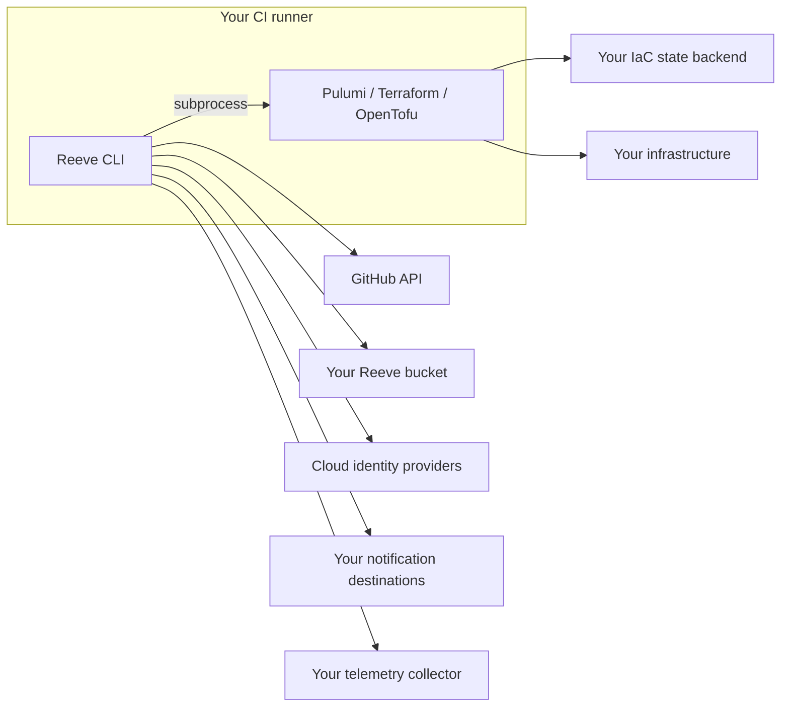

# Self-hosting

Reeve runs in your CI and stores nothing itself. Everything persistent lives in infrastructure you control.

## What you operate

| Component | Purpose | Required for a persistent GitOps setup? |
| --- | --- | --- |
| GitHub repository and Actions runner | Events, reviews, commands, and execution. | Yes. |
| Reeve bucket | Locks, saved plans, run artifacts, audit, drift, notification state. | Yes. |
| IaC state backend | Pulumi/Terraform/OpenTofu state, configured for your workload. | Yes; separate from Reeve's artifact storage. |
| Cloud identities | Bucket, backend, and workload access. | As required by the chosen services. |
| GitHub App | Optional branded API identity or installation-level permissions. | No. |
| Slack, incident service, telemetry collector | Optional notifications and observability. | No. |

No Reeve server, hosted database, account, or credential shared with Reeve maintainers is required.
The CLI invokes your engine and communicates directly with the services you configure.

## Scope of trust



The diagram shows process and service connections, not an assertion that every destination lies outside your organization's trust boundary.
Reeve constructs engine environments, but it is not an OS sandbox; isolate untrusted execution using an appropriate runner, user, container, or VM boundary.

## Bucket provisioning

Choose a private bucket with conditional-write support and grant the Reeve controller access to its namespace.
Keep it separate from unrelated repositories, or give each configured root a distinct prefix.

Saved engine plans can contain sensitive resource values; unlike the rendered summary, an opaque plan cannot be redacted and remain executable.
Treat this bucket with the same access controls as your IaC state backend.

### AWS S3

For a bucket in `us-east-1`:

```bash
aws s3api create-bucket --bucket YOUR_REEVE_BUCKET --region us-east-1
aws s3api put-bucket-versioning --bucket YOUR_REEVE_BUCKET \
  --versioning-configuration Status=Enabled
aws s3api put-public-access-block --bucket YOUR_REEVE_BUCKET \
  --public-access-block-configuration \
  'BlockPublicAcls=true,IgnorePublicAcls=true,BlockPublicPolicy=true,RestrictPublicBuckets=true'
```

Other regions require the matching `LocationConstraint`; see [AWS create-bucket](https://docs.aws.amazon.com/cli/latest/reference/s3api/create-bucket.html).
Grant `s3:ListBucket` on the bucket and `s3:GetObject`, `s3:PutObject`, `s3:DeleteObject` on the configured object namespace; add version/KMS permissions when your storage configuration requires them.

```yaml
# bucket: block in .reeve/shared.yaml
bucket:
  type: s3
  name: YOUR_REEVE_BUCKET
  region: us-east-1
  prefix: reeve/
```

Use [runner authentication](github-actions.md#bucket-authentication) for the controller.
The [AWS OIDC recipe](../examples/aws-oidc/README.md) separately configures workload and backend access.

### GCS

```bash
gcloud storage buckets create gs://YOUR_REEVE_BUCKET \
  --project=YOUR_PROJECT --location=us --uniform-bucket-level-access
gcloud storage buckets add-iam-policy-binding gs://YOUR_REEVE_BUCKET \
  --member=serviceAccount:YOUR_REEVE_SERVICE_ACCOUNT \
  --role=roles/storage.objectAdmin
```

```yaml
bucket:
  type: gcs
  name: YOUR_REEVE_BUCKET
  prefix: reeve/
```

Connect the service account through the shared workflow's GCP inputs.
The [GCP recipe](../examples/gcp-wif/README.md) covers federation setup; a separate engine binding supplies workload credentials.

### Azure Blob

```bash
az storage container create --account-name YOUR_STORAGE_ACCOUNT \
  --name reeve --auth-mode login
```

```yaml
bucket:
  type: azblob
  name: reeve
  region: https://YOUR_STORAGE_ACCOUNT.blob.core.windows.net
  prefix: reeve/
```

Grant the runner identity the necessary blob data permissions on this container.
The controller uses the Azure SDK credential chain; see [bucket authentication](github-actions.md#bucket-authentication).

### Cloudflare R2

```yaml
bucket:
  type: r2
  name: YOUR_REEVE_BUCKET
  prefix: reeve/
```

Provide the controller's S3-compatible credentials and endpoint in a prepared runner or custom action job:

```yaml
env:
  AWS_ACCESS_KEY_ID: ${{ secrets.R2_ACCESS_KEY_ID }}
  AWS_SECRET_ACCESS_KEY: ${{ secrets.R2_SECRET_ACCESS_KEY }}
  AWS_ENDPOINT_URL_S3: https://YOUR_ACCOUNT.r2.cloudflarestorage.com
```

Scope credentials to the Reeve bucket and manage their rotation outside the repository.
These are controller credentials, not automatic engine environment variables.

### Filesystem

```yaml
bucket:
  type: filesystem
  name: ./.reeve-state
```

Use this for local demos and tests whose lifecycle stays in one job.
Fresh hosted runners do not share this directory, so it cannot coordinate locks or reuse a preview across separate workflow runs.

### Conditional operations

Locks require storage that enforces conditional writes and deletes.
An S3-compatible endpoint accepting an HTTP header is not proof that it enforces the condition; Reeve checks required behavior and fails when it cannot rely on it.

The evolving [reeve-test storage lanes](https://github.com/reeveops/reeve-test/blob/master/e2e/cloud-buckets.md) exercise selected adapters.
Read the lane's source pin and result before treating it as acceptance of a particular service/version.

## Retention and recovery

Schedule [maintenance](operations.md#scheduled-maintenance) to prune old `runs/` artifacts and reap expired locks.
Choose separate retention for audit records, drift reports, and storage versions according to your needs.

A lifecycle prefix must include `bucket.prefix`: with `prefix: reeve/`, run objects start at `reeve/runs/`, not `runs/`.
Do not apply blanket expiration to active lock or notification state.

Use your provider's lifecycle format; an S3 lifecycle JSON document is not a GCS lifecycle policy.
See [GCS lifecycle configuration](https://docs.cloud.google.com/storage/docs/lifecycle) and your bucket provider's tooling.

Keep backups/versioning appropriate to your recovery needs.
Write-once audit creation by Reeve is not protection against a bucket administrator deleting objects.

## Continue setup

- [GitHub Actions](github-actions.md): caller workflows, GitHub App identity, versions, and platform support.
- [Authentication](auth.md): controller versus backend/workload credentials.
- [Operations](operations.md): locks, artifacts, monitoring, recovery, and upgrades.

## Support and licensing

Reeve is MIT licensed and committed to remaining permissively licensed.
Report problems through GitHub issues; use [private vulnerability reporting](../SECURITY.md#reporting-a-vulnerability) for security reports.

Support is best effort, without an SLA.
Reeve never sends usage analytics to its maintainers; optional OpenTelemetry goes to your configured collector.
